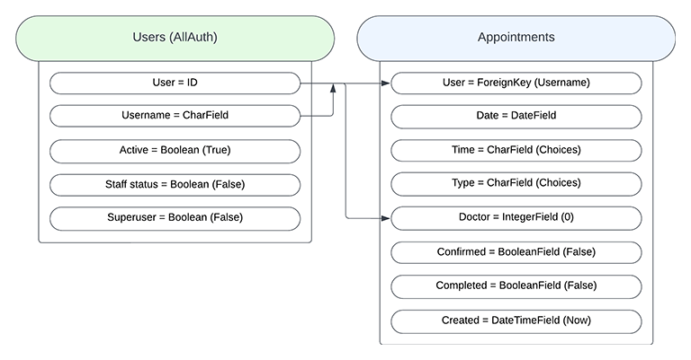
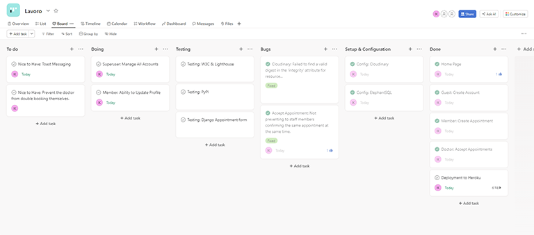
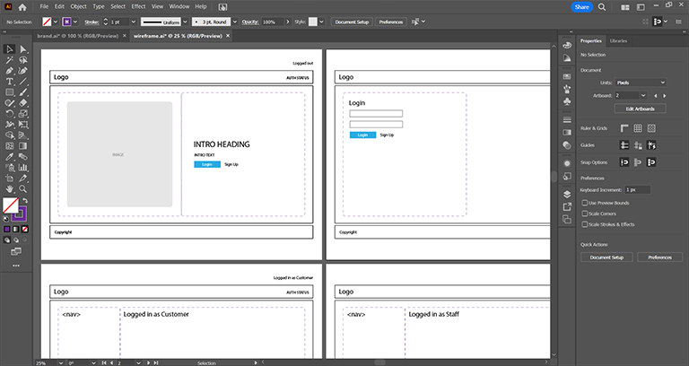
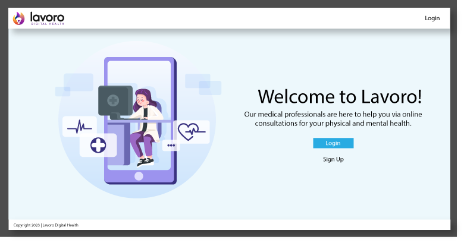
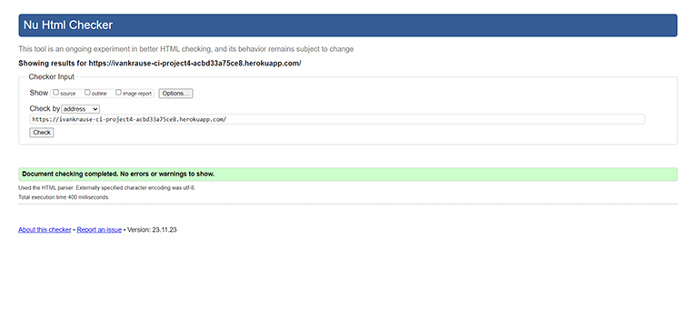
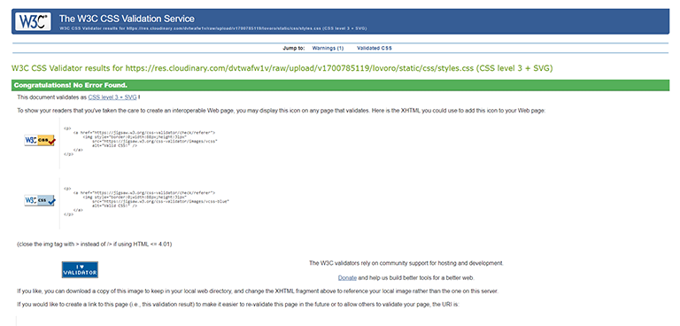
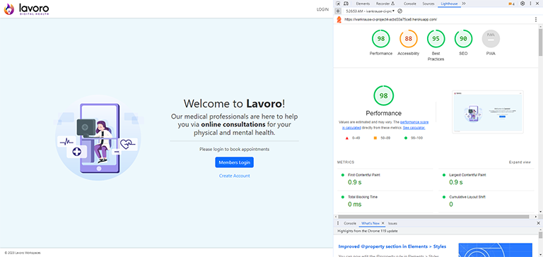

# Lavoro Digital Health
As a person that struggles with social anxiety and mental health issues, I feel uncomfortable around people but I still need to interact with medical professionals from time to time because of my health issues. I really liked the idea of an online consultation in the privacy of your own home, but in my experience, the current platforms are still too complicated. I hope one day to simplify this process.

## Contents
- [Technology Stack](#technology-stack)
- [User Experience](#user-experience)
- [Setup and Deployment](#setup-and-deployment)
- [Testing](#testing)
- [Bugs](#bugs)
- [Toolbox](#toolbox)
- [Resources and Credits](#resources-and-credits)

## Technology Stack
See [requirements.txt](https://github.com/ivankrauseza/ci-project4/blob/main/requirements.txt) for an overview of the development environment.  
- Python (Django)
- HTML & CSS (Bootstrap @ 5.3.2)
- JavaScript (jQuery @3.7.1 and jQueryUI @ 1.13.2)
- Database (Postgres - ElephantSQL)
- Icons FontAwesome @latest
- Media (Cloudinary)
- Markdown (ReadMe)

## User Experience
The main aim was to be as ruthlessly simple as possible. The homepage tells you in brief about what Lavoro is, and that you need to login as a member to use the platform. A clean, easy on the eye and uncluttered display to keep the user calm. It was determined that we would need 3 specific user types of Non-Staff (Member), Staff (Doctors), and Superuser (Admin).

### Features
- Guest creates a free account to become a Member
- Members create appointments for a specific day and preset time (11am, 2pm, 7pm)
- Doctors accept the appointment
- Members can see that their appointment has been accepted
- Doctor manually send the Member a video call link via email
- Offline: Doctor confirms the completion of the appointment (any prescriptions are sent directly to a pharmacy)
- Offline: Member is manually invoiced after the completion of the session via email

#### Future Features
- A Doctor would be able to click on an appointment that they have accepted, view more details about the Member 
- A Doctor would be able to send the Member the video call link from within the App
- A Doctor would be able to 'Complete' the appointment which will invoice the Member
- A Member will see all invoicing
- A Member will be able to pay through the App

### Database Schema
We are using the default User table and our custom Appointment table. The Appointment table links two objects to the User table (member & doctor). However the doctor object is merely a reference to the ID of the User who accepts the appointment.

### User Stories
The user stories are created and managed through Asana.  

### Wireframes
Wireframes produced in Adobe Illustrator.

### Mockup

## Setup and Deployment
- Live Deployment: https://ivankrause-ci-project4-acbd33a75ce8.herokuapp.com
- GitHub Repository: https://github.com/ivankrauseza/ci-project4

### Setup Django Project
- django-admin startproject lavoro .
- python manage.py startapp appointment
- python manage.py startapp member
- python manage.py startapp dashboard
- touch env.py
- touch .gitignore (add env.py to .gitignore)

### Setup Database
- SQLite: Initial testing
- ElephantSQL: Primary Database

### Setup Admin Backend
- python manage.py makemigrations
- python manage.py migrate
- python manage.py createsuperuser (u: ****** / e: ****** / p: ******)
- python manage.py runserver
- visit http://localhost:8000/admin to test the backend

### Settings.py
- settings.py > import os
- settings.py > ALLOWED_HOSTS = ['localhost']
- settings.py > SITE_ID = 1
- settings.py > EMAIL_BACKEND = 'django.core.mail.backends.console.EmailBackend'
- settings.py > MESSAGE_STORAGE = 'django.contrib.messages.storage.session.SessionStorage'

### Templates
- settings.py > TEMPLATES > 'DIRS': [os.path.join(BASE_DIR, 'templates')],
- create 'templates/base.html'

### Authentication
- pip install django-allauth ([see documentation](https://docs.allauth.org/en/latest/installation/quickstart.html))
- Copy default AllAuth templates to templates/account (make sure to extend base.html)
- Implemented 'BOOTSTRAP TOASTS' to notify the user during login and logout (bottom left and auto hide)

### Static files 
#### Development
- settings.py > STATIC_URL = '/static/'
- settings.py > STATICFILES_DIRS = [os.path.join(BASE_DIR, 'static'),]
- settings.py > STATIC_ROOT = os.path.join(BASE_DIR, 'staticfiles')

#### Production
- Cloudinary (See settings.py for config)

### Deployment to Heroku
- Create Procfile (web: gunicorn lavoro.wsgi)
- Freeze requirements (pip freeze > requirements.txt)
- Create New Project
- Region: Europe 
- Setup Config Vars
- Deployment Method: GitHub > 'ci-project4'
- Choose a branch to deploy 'main'
- Deploy Manually

## Testing
### Manual Testing 
Manual testing was performed to validate that the Authentication and the Appointment booking system function correctly. Testing was also done on the interaction between the Member creating the appointment and the Doctor accepting the appointment from their views. A member CAN create, read, update and delete an appointment and a Doctor CAN accept an appointment which UPDATES the 'confirmed' field from False to True.  

Bootstrap Toast messages were also implemented to alert the User as to the status of the Form submission.

### Validator Testing 
#### W3C HTML
Most of the errors were related to  <input> and 
 tags as the trailing slash needed to be removed. There are also some issues related to the dynamic output of the AllAuth signup template which are not clear so I could not resolve.

#### W3C CSS

#### PEP8
I have tested my code using https://www.pythonchecker.com/ and there are some issues where the errors refer to spacing around operators. Example: ('/') where it has recommended that I put a space around the operator like (' / ') which obviously breaks the path. I also received errors where the indentation should be 4 spaces but VS Code is tabbing the indentations but the code works fine according to the VSCode linter.

#### Lighthouse
Overall, the Lighthouse test performed reasonably ok, across all pages.

## Toolbox
### Test Users
- Superuser: ivankrause / N01dea123abc
- Doctor doctor2 / gOj11K02tsA
- Member member1 / N01dea123abc

## Bugs
- FIXED: CSS: background images not showing (path to static file needed to change)
- CALENDAR: User can manually edit calender field (prevent picking past date, only future)
- FONTAWESOME: icons flashing on reload

## Resources and Credits
### Walkthroughs for inspiration
- Code Institute Walkthroughs: (Hello Django, I think therefore I blog, Boutique Ado)
- [Learning Django](https://www.linkedin.com/learning/learning-django-2/rapidly-create-web-applications)
- [MDN - Local Library](https://developer.mozilla.org/en-US/docs/Learn/Server-side/Django/Tutorial_local_library_website)

### Look & Feel Artwork
- [Flame Lion Icon](https://www.freepik.com/free-vector/lion-fire-gradient-mascot-illustration-logo-design_54089107.htm)
- [Homepage Illustration](https://www.freepik.com/free-vector/doctor-using-online-app-help-patients_7881487.htm)
- Favicon created with: [https://favicon.io/](https://favicon.io/)
- FALSE: https://timepicker.co/
- Google Fonts (Roboto)

- Meeting image : https://www.freepik.com/free-vector/social-distancing-meeting-illustration-theme_8256854.htm#query=meeting%20room&position=0&from_view=search&track=ais&uuid=57a3fe96-1158-4868-8372-122d8170d273
- LinkedIn Learning: https://www.linkedin.com/learning/django-forms/
- GoogleAuth: https://pylessons.com/django-google-oauth
- https://www.toptal.com/designers/htmlarrows/symbols/